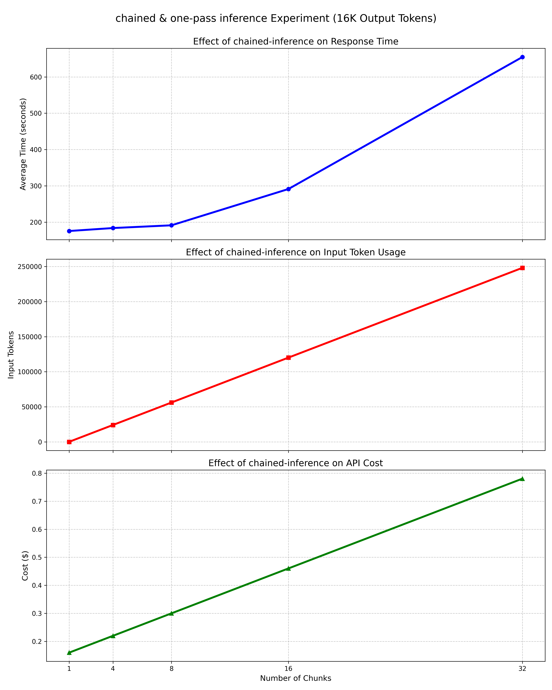

# One-Pass vs Chained Inference Experiment

**Setup**:  
We used Llama-3.1-8B-instruction to perform inference on 1,000 queries, with each query producing 16K tokens in output. We compared one-pass inference (single request) with chained inference strategies involving 4, 8, 16, and 32 sequential requests. For example, in the 8-chain setting, generating the full 16K tokens requires 8 requests, each producing 2K tokens.  

To ensure precise control over output length, we disabled early stopping via the `eos_token` and instead relied on setting an exact `max_tokens`

Deployed on 8×H800 GPUs with 64-way concurrency, which mirrors many real-world inference scenarios.

The table and figure below show the **average per-query** latency, number of input tokens, and the input/output token ratio (as a measure of cost overhead):

| Strategy  | Time (s) | Input Tokens | Input/Output Ratio |
|-----------|----------|---------------|---------------------|
| One-Pass  | 175.7    | 11            | 0.0007              |
| 4-Chain   | 183.9    | 24,034        | 1.50                |
| 8-Chain   | 191.4    | 56,070        | 3.50                |
| 16-Chain  | 291.3    | 120,117       | 7.51                |
| 32-Chain  | 654.8    | 248,141       | 15.51               |

**Key Findings**:
- One-pass inference is the fastest and most token-efficient
- 4-chain and 8-chain strategies introduce only minor overhead (~5–9% slower)
- 16-chain and 32-chain strategies lead to significantly higher latency and input token cost

**Visualization**:

